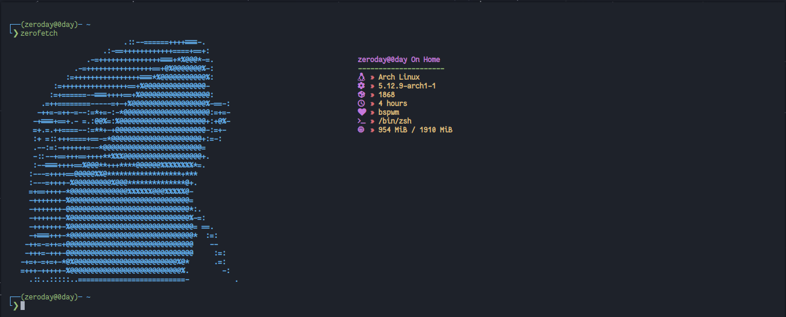
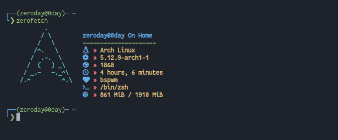
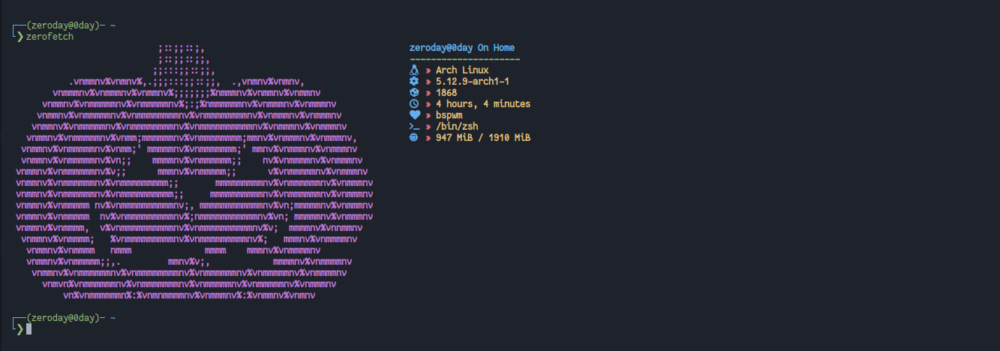

# Zero-Fetch
Zero-Fetch : A CLI System Information Tool 

## Installation
### One-Linear Install
```
sudo wget https://raw.githubusercontent.com/The-0Day/Shark-Fetch/main/sharkfetch -O /usr/local/bin/sharkfetch && sudo chmod +x /usr/local/bin/sharkfetch
```
### Clone & Install
```
git clone https://github.com/The-0Day/Zero-Fetch.git

```

Make The File Executable And Put zero-fetch In ```/usr/local/bin```
```
cd Zero-Fetch
chmod +x zerofetch
sudo cp zerofetch /usr/local/bin
```


## Themes

To Use Your Favorite Theme, Open The File, Then Uncomment Your Favorite Theme, The Default Theme Is Shark.

***Shark Theme (Default)***



***Arch Theme***



***Halloween Theme***




