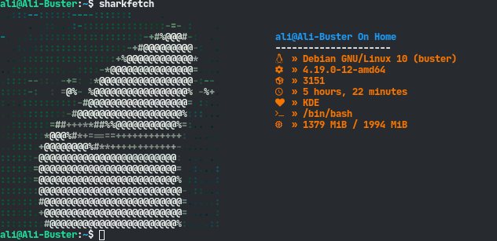
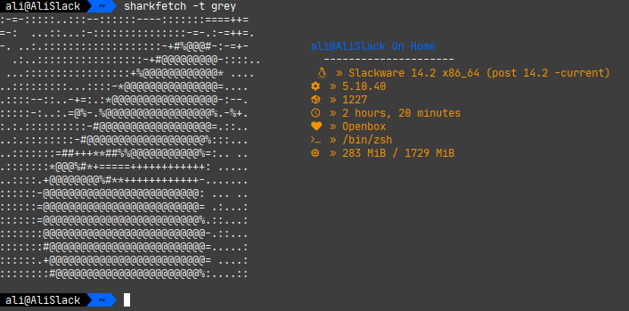

# SharkFetch
  an Eye-Candy Customizable CLI System Information Tool 



## Installation
### One-Linear Install
```
sudo wget https://raw.githubusercontent.com/The-0Day/SharkFetch/main/sharkfetch -O /usr/local/bin/sharkfetch && sudo chmod +x /usr/local/bin/sharkfetch
```
### Clone & Install
```
git clone https://github.com/The-0Day/SharkFetch.git
```

Make The File Executable And Put sharkfetch In ```/usr/local/bin```
```
cd SharkFetch
chmod +x sharkfetch
sudo cp sharkfetch /usr/local/bin
```


## Themes
<br/><br/>
This Script Can Load ASCII Art as Themes, It Has 3 Default Themes but You Can Use Your Custom Themes Too.<br/>
You Can Use [This Project](https://github.com/TheZoraiz/ascii-image-converter) to Make ASCII Arts.
Recommended Size For Your ASCII Art is 40x20


In Order To Load:<br/>\
(In Directory which Your Theme Located Too (example.txt))
  ```sharkfetch -t example.txt```

But You Can Import Your Theme in Configuration Directory and Use it Several Times: <br/>
First of All Put Your Theme File in ```~/.config/SharkFetch/themes/```<br/>
its Better to Remove .txt Extension From The File, Then<br/>
  ```sharkfetch -t example```<br>
      it will use ~/.config/SharkFetch/themes/example theme

<br/>Tip: You Can Findout Available Themes With ```--list``` or ```-l``` Switch.<br/>
Note: If You Made an Awesome Theme which You Think Someone Would Like too, Feel Free to PR it On ```Users_Themes``` Directory of Main Repo.

### Known Issues
#### Icons Issue
If Your Terminal Doesn't Show Icons Well, You Have to Install a Nerd Font.<br/>
##### Install Our Recommended Font:
Then clone this repo, copy all fonts to ```.fonts```

### Bonus Tip
Enter ```sharkfetch -t wood``` and You Will See The Big Wood Guy :D

### Contribution :handshake:
Open Source Projects Live With Contributions & Without Participation a Lot of Daily Used Projects Would Have Remained at The First Step.<br/>
Feel Free to Tell us Your Ideas and PR if This Script Has Bugs on your Distro.


## Team
This project is maintained by the following people.
| [](https://github.com/The-0Day) | [](https://github.com/Ali-Frh)  |
| --- | --- |
| [The-0Day](https://github.com/The-0Day) | [Ali-Frh](https://github.com/Ali-Frh) |


